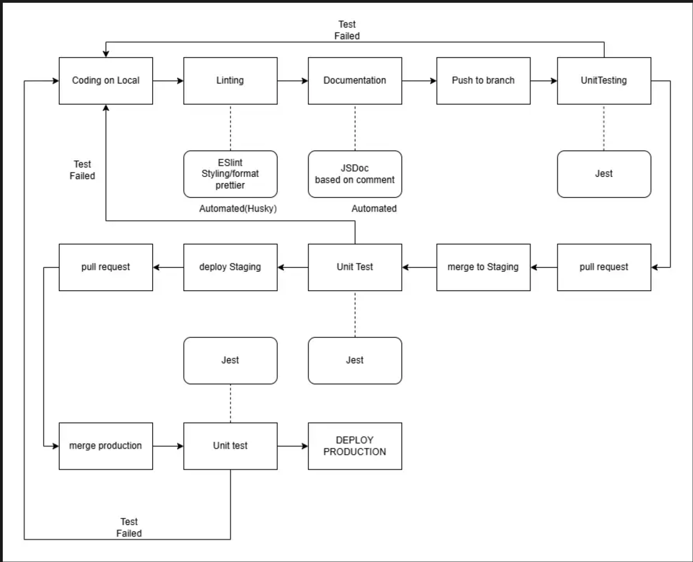

# CI/CD Pipeline

## Status of the Pipeline (Functional)

1. **Development (Local)**
   - We make a small change or add a feature.

2. **Linting and Coding Styling:**
   - Enabled ESLint for linting and Prettier for code styling on our local editor (via IDE settings and extensions).
   - Scripts can be run for linting and formatting before committing the code.
   - Pre-commit checks for consistent linting and formatting are implemented using **Husky**.

3. **Documentation:**
   - Automatically generate a folder based on **JSDoc comments**.
   - Display detailed information about the function/method.

4. **Unit Testing (Local vs Dev vs Prod):**
   - Automated testing when code is pushed to Github, using workflow.
   - Shows result in Github Actions section after push

5. **Deployment**
    - The decision is made based on the pros and cons of different servers and platforms.
    - Automated deployment pipeline with Firebase on GitHub

### Planned Features:
1. **Environment Separation:**
   - Create two automated deployment stages:
     - **Development:** For development code and implementation.
       - A branch from development is used for feature development.
       - Create a PR to the development branch for merging changes.
     - **Production:** For production-ready code.
       - Once a feature tests well in the development branch, create a PR to merge the feature into the production branch.

2. **Gamification Implementation:**
   - Design and implement an animated pet with level/score indicators.
   - Build a system with rewards and punishments corresponding to task accomplishment.
