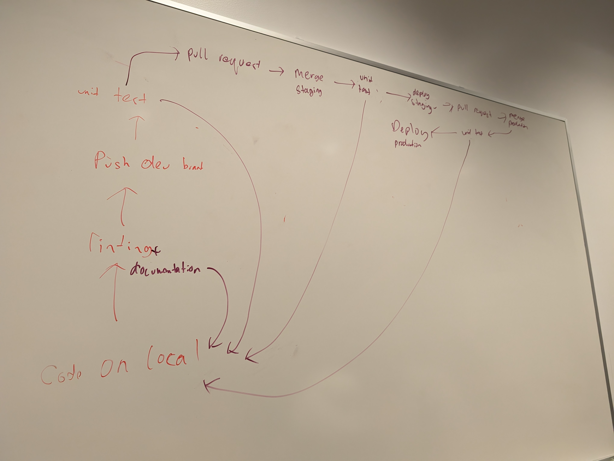

## Attendence

- Joey
- Soumya
- Matthew
- Yuan
- Steve
- Gavin
- Sakshi
- Li
- Kuber

## Accomplishments

### Overview

This week we accomplished selecting an existing codebase to base our project
off of, setting up our CI/CD pipeline and making minor changes to the codebase
in preparation for the next sprint.

At the start of the sprint (11th November), we held a planning meeting where
we reviewed multiple existing task managers and todo list web apps, discussed the
pros and cons of each and chose a codebase to fork from. We then created tasks for
the sprint, tracking them via Github Project and Issues.

We put together our CI/CD pipeline at the end of the sprint. The team met in person
to run through our pipeline. We conducted a simple test of the pipeline by pushing
some simple code to make sure each component is behaving as expected.

We also made simple features to the codebase in preparation for our next sprint,
including adding fields to task creation and saving task objects to localstorage.

### Status of the Pipeline

- Development (Local)
  - Make a small change or add a feature.
- Linting and coding styling
  - Enabled ESLint for linting and Prettier for code styling on our local editor (via IDE setting and extension). Can run scripts for linting and formatting before committing the code
  - Enabled pre-commit checks for consistent linting and formatting through Husky.
- Documentation
  - Generate a folder based on JSDoc comments
  - Display detailed information about function/method
- Environment Separation (dev vs prod)
  - dev vs prod branching
  - PR and merge staging
- Unit Testing (local vs dev vs prod) (Automated Test, Jest)
  - Automated testing when code is pushed to Github, using workflow
  - Shows result in Github Actions section after push
- Deployment
  - The decision is made based on the pros and cons of different servers and platforms.
  - Automated deployment pipeline with Firebase on GitHub

### Individual Notes

- Joey: Set up repo, project and issues tracker. Planned first sprint
- Matthew: Created task class and implemented saving tasks to localstorage after
  creation
- Yuan: Add Jest to our repo and enable automated testing on pushing to main branch
- Steve: Add new fields to task class according to design, making them editable
- Gavin: Did research into deployment methods. Set up automated deployment via
  Firebase
- Soumya: Implement some restrictions on existing kanban board, removed some
  unnecessary features from codebase
- Sakshi: Investigated Jest and its features
- Li: Figured out how to use JSDocs to generate documentation
- Kuber: Added linter+styler to repo via ESLint and Prettier, enabled
  pre-commit checks in addition to local VSCode checks

